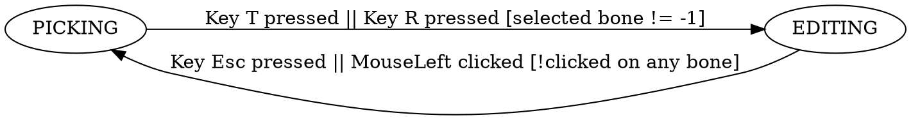

```dot
digraph {
    nodesep=1
    rankdir=LR
    PICKING -> EDITING [label="Key T pressed || Key R pressed [selected bone != -1]"]
    EDITING -> PICKING [label="Key Esc pressed || MouseLeft clicked [!clicked on any bone]"]
}
```