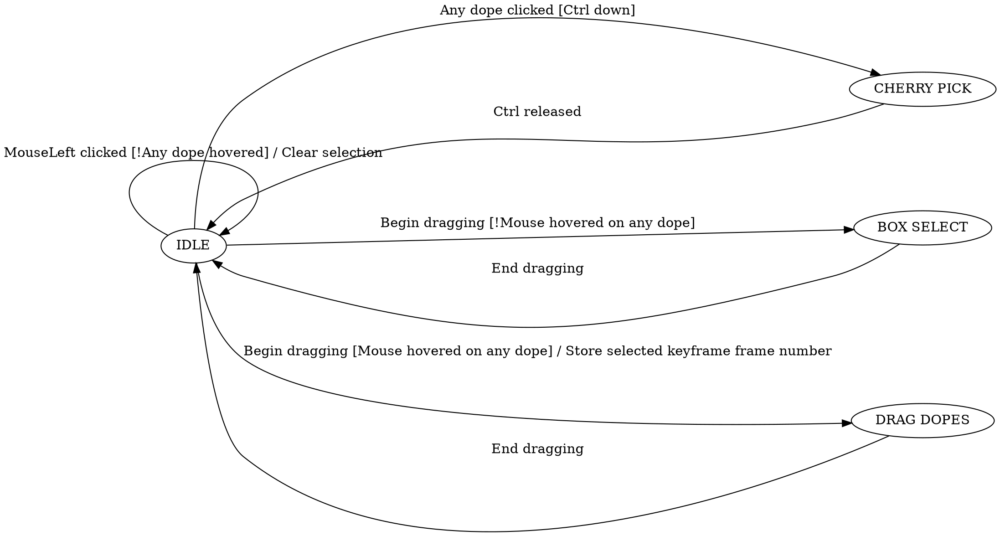

```dot
digraph {
    nodesep=1
    rankdir=LR
    IDLE -> "CHERRY PICK" [label="Any dope clicked \[Ctrl down\]"]
    "CHERRY PICK" -> "IDLE" [label="Ctrl released"]

    IDLE -> "BOX SELECT" [label="Begin dragging \[!Mouse hovered on any dope\]"]
    "BOX SELECT" -> IDLE [label="End dragging"]

    IDLE -> "DRAG DOPES" [label="Begin dragging \[Mouse hovered on any dope\] / Store selected keyframe frame number"]
    "DRAG DOPES" -> IDLE [label="End dragging"]

    IDLE -> IDLE [label="MouseLeft clicked \[!Any dope hovered\] / Clear selection"]
}
```